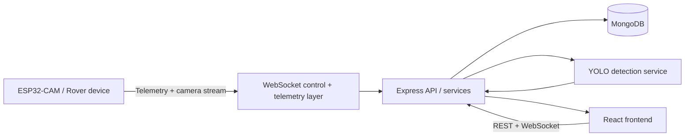

# APEX Architecture

This project is a full-stack rover monitoring system with a React frontend, Express backend, MongoDB persistence, and a WebSocket-based control layer.

## High-level flow

## Frontend

- Framework: React + Vite
- State: Redux Toolkit
- Routing: React Router
- UI: custom components and CSS modules in the existing codebase
- Key responsibility: dashboard display, vehicle monitoring, rover commands, geofence controls, and event/snapshot views

## Backend

- Framework: Express.js
- Runtime: Node.js
- Authentication: JWT-based auth middleware with access/refresh tokens
- API versions: `/api/v1`
- Persistence: MongoDB with Mongoose models

## Database

The project stores vehicles, users, events, and snapshots in MongoDB. The active schema contains:

- `User`
- `Vehicle`
- `Event`
- `Snapshot`

## Authentication

Authentication is handled by the backend auth controller and middleware. The frontend stores login state in Redux and redirects to the protected dashboard route when a valid token is present.

## Real-time communication

APEX uses WebSockets for rover and camera communication. The backend exposes a websocket manager and vehicle/camera socket services for live monitoring and command dispatch.

## ESP32 / camera flow

The rover camera and controller send telemetry and alert data into the backend. The backend also exposes endpoints for snapshot capture and YOLO inference.

## Telemetry and event processing

Telemetry updates are stored on the `Vehicle` record and exposed via the `GET /vehicles/me` endpoint. Event records are created when geofence issues, snapshots, or detections occur.

## Snapshot processing

Snapshots are stored as JPEG binary data, with metadata in the `Snapshot` model. Detection metadata is attached when an inference service is available.

## Storage and retention

Retention is implemented through soft-deletion fields on event and snapshot records:

- `isDeleted: false` = active record
- `deletedAt: null` = active record
- `isDeleted: true` after retention window = soft deleted
- records older than 12 months should be permanently removed by a scheduled cleanup process

## Deployment notes

- Frontend is served by Vite during local development
- Backend runs as a Node.js Express process
- Environment variables drive database access, tokens, and AI service configuration
